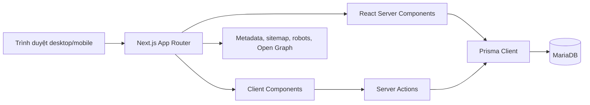

# Đặc tả website Heo Xinh

> Phiên bản sản phẩm: **V8.1.0**
> Trạng thái tài liệu: **Đặc tả theo hệ thống đang hoạt động (as-built)**  
> Ngày cập nhật: **02/08/2026**

## 1. Tổng quan sản phẩm

**Tên thương hiệu:** Heo Xinh  
**Slogan:** Tiết kiệm và giải trí.

Heo Xinh là website kết hợp ghi chép tài chính cá nhân đơn giản với khu giải trí trí tuệ. Người dùng ghi nhận tiền vào, tiền ra, tiền tip, danh mục, phương thức và khoản nợ; sau đó có thể thư giãn với Cờ Caro XO trong cùng một tài khoản.

Sản phẩm hướng đến:

- Học sinh và sinh viên cần kiểm soát chi tiêu hằng ngày.
- Mẹ bỉm, phụ huynh và gia đình trẻ cần ghi lại chi phí sinh hoạt.
- Người làm tự do, tài xế công nghệ và người có thu nhập theo ngày.
- Người muốn có một sổ thu chi đơn giản, không cần nghiệp vụ kế toán phức tạp.

## 2. Mục tiêu và phạm vi

### 2.1. Mục tiêu

- Ghi một khoản thu hoặc chi nhanh, dễ hiểu trên mọi thiết bị.
- Tổng hợp dòng tiền theo tháng.
- Cho phép lưu cách cộng tiền thực tế, ví dụ `10000 + 20000 + 11000`.
- Theo dõi tiền tip tách biệt nhưng vẫn tính vào tổng giao dịch.
- Biết giao dịch đã dùng tiền mặt, ngân hàng hay ví điện tử mà không quản lý số dư ví.
- Theo dõi khoản cần trả, khoản cần thu, tiến độ và lịch sử thanh toán.
- Hỗ trợ tất toán sớm bằng số tiền thực trả thấp hơn số còn lại.
- Cung cấp landing page công khai, dễ chia sẻ và thân thiện SEO.
- Cung cấp khu giải trí có giao diện thống nhất, responsive và dễ mở rộng thêm trò chơi.
- Cho phép chơi Cờ Caro XO qua phòng riêng hoặc ghép hạng, với server xác nhận toàn bộ nước đi.

### 2.2. Ngoài phạm vi hiện tại

Hệ thống hiện chưa cung cấp:

- Quản lý số dư của tài khoản ngân hàng, ví điện tử hoặc tiền mặt.
- Đồng bộ tự động với ngân hàng hoặc ứng dụng tài xế.
- Ngân sách theo danh mục, mục tiêu tiết kiệm hoặc giao dịch định kỳ.
- Xuất Excel/PDF, nhập dữ liệu hàng loạt hoặc sao lưu từ giao diện.
- Khôi phục mật khẩu qua email, xác minh email hoặc OTP điện thoại.
- Thông báo đến hạn qua email, Zalo hoặc push notification.
- Ứng dụng mobile native hoặc chế độ offline/PWA hoàn chỉnh.
- API công khai dành cho ứng dụng bên thứ ba.
- Ghép trận online, đồng bộ nước đi, chat hoặc bạn bè qua máy chủ thời gian thực.
- Thành tích/huy hiệu có điều kiện mở khóa tự động và phần thưởng vật phẩm vẫn thuộc hướng phát triển tiếp theo.

## 3. Vai trò và phân quyền

| Vai trò       | Phạm vi sử dụng                                                                               |
| ------------- | --------------------------------------------------------------------------------------------- |
| Khách         | Xem landing page, FAQ, chính sách riêng tư, trang hỗ trợ; đăng ký hoặc đăng nhập.             |
| Người dùng    | Quản lý dữ liệu thu chi, danh mục, phương thức, khoản nợ và thông tin cá nhân của chính mình. |
| Quản trị viên | Có toàn bộ quyền người dùng; quản lý trạng thái đăng ký và tài khoản người dùng.              |

Quy tắc phân quyền:

- Mọi truy vấn dữ liệu cá nhân phải kèm `userId` của phiên đăng nhập.
- Người chưa đăng nhập truy cập trang riêng tư sẽ được chuyển đến `/login`.
- Người dùng thường truy cập `/admin` sẽ được chuyển về `/dashboard`.
- Quản trị viên không được khóa hoặc xóa chính mình.
- Tài khoản quản trị khác không thể bị khóa hoặc xóa từ giao diện quản trị.

## 4. Sơ đồ kiến trúc



Kiến trúc sử dụng:

- Next.js App Router cho route, layout, metadata và render phía máy chủ.
- React Server Components cho phần lớn việc đọc dữ liệu.
- Client Components cho modal, bộ lọc tức thời, nhập tiền, đổi ngôn ngữ và trạng thái giao diện.
- Server Actions cho các thao tác tạo, sửa, xóa và xác thực.
- Prisma ORM kết nối MariaDB thông qua MariaDB adapter.
- Điều hướng nội bộ bằng `next/link`, prefetch và React Server Component navigation; trang không tải lại toàn bộ như website HTML truyền thống.

## 5. Danh sách trang và quyền truy cập

| Đường dẫn                     | Đối tượng     | Chức năng chính                                                     | SEO     |
| ----------------------------- | ------------- | ------------------------------------------------------------------- | ------- |
| `/`                           | Công khai     | Landing page, giới thiệu, đối tượng sử dụng, tính năng, FAQ và CTA. | Index   |
| `/privacy`                    | Công khai     | Chính sách riêng tư.                                                | Index   |
| `/support`                    | Công khai     | Hướng dẫn và thông tin liên hệ hỗ trợ.                              | Index   |
| `/login`                      | Công khai     | Đăng nhập tài khoản.                                                | Noindex |
| `/register`                   | Công khai     | Đăng ký tài khoản.                                                  | Noindex |
| `/dashboard`                  | Đã đăng nhập  | Tổng quan tài chính theo tháng.                                     | Noindex |
| `/transactions`               | Đã đăng nhập  | Sổ thu chi và quản lý giao dịch.                                    | Noindex |
| `/categories`                 | Đã đăng nhập  | Quản lý danh mục và phương thức.                                    | Noindex |
| `/debts`                      | Đã đăng nhập  | Quản lý khoản nợ, thanh toán, tất toán và nhật ký.                  | Noindex |
| `/settings`                   | Đã đăng nhập  | Hồ sơ và đổi mật khẩu.                                              | Noindex |
| `/admin`                      | Quản trị viên | Quản lý đăng ký và tài khoản.                                       | Noindex |
| `/games`                      | Đã đăng nhập  | Trung tâm trò chơi và danh sách trò chơi.                           | Noindex |
| `/games/caro`                 | Đã đăng nhập  | Sảnh Cờ Caro XO, ghép trận và tạo/tham gia phòng.                   | Noindex |
| `/games/caro/room/[roomCode]` | Đã đăng nhập  | Phòng riêng và chia sẻ mã mời.                                      | Noindex |
| `/games/caro/match/[matchId]` | Đã đăng nhập  | Bàn Cờ Caro XO 19×19 đồng bộ và xác thực phía server.               | Noindex |
| `/games/friends`              | Đã đăng nhập  | Danh sách bạn, lọc và trò chuyện mẫu.                               | Noindex |
| `/games/caro/profile`         | Đã đăng nhập  | Hồ sơ, thống kê, hệ thống hạng và thành tích.                       | Noindex |
| `/games/caro/leaderboard`     | Đã đăng nhập  | Bảng xếp hạng và vị trí người chơi.                                 | Noindex |

## 6. Đặc tả chức năng

### 6.1. Landing page công khai

Landing page phải:

- Truy cập được mà không cần đăng nhập.
- Hiển thị thương hiệu, slogan và lời kêu gọi đăng ký.
- Trình bày nhóm tính năng, nhóm người dùng phù hợp, quy trình sử dụng và FAQ.
- Có liên kết đến đăng nhập, đăng ký, chính sách riêng tư và hỗ trợ.
- Hỗ trợ tiếng Việt mặc định và tiếng Anh tùy chọn.
- Có hình minh họa responsive và nội dung thay thế cho hình ảnh.
- Xuất JSON-LD cho `WebApplication` và `FAQPage`.
- Có canonical URL, Open Graph và Twitter Card.

### 6.2. Đăng ký

Người dùng đăng ký bằng:

- Email duy nhất, được chuẩn hóa chữ thường.
- Số điện thoại Việt Nam hợp lệ và duy nhất.
- Mật khẩu từ 8 đến 128 ký tự.
- Nhập lại mật khẩu phải trùng khớp.

Sau khi đăng ký thành công:

- Mật khẩu được băm bằng bcrypt với cost 12.
- Tên hiển thị ban đầu lấy từ phần trước ký tự `@` của email.
- Hệ thống tạo sẵn danh mục: Lương, Làm thêm, Ăn uống, Di chuyển, Sinh hoạt.
- Hệ thống tạo sẵn phương thức: Tiền mặt, Chuyển khoản, Ví điện tử.
- Phiên đăng nhập được tạo và người dùng được chuyển tới `/dashboard`.

Quản trị viên có thể đóng đăng ký. Khi đóng, người dùng mới không thể tạo tài khoản nhưng tài khoản hiện có vẫn đăng nhập được.

### 6.3. Đăng nhập và đăng xuất

- Đăng nhập bằng email và mật khẩu.
- Từ chối đăng nhập nếu thông tin sai, tài khoản không hoạt động hoặc bị khóa.
- Cập nhật thời điểm đăng nhập gần nhất sau khi xác thực thành công.
- Đăng nhập thành công chuyển tới `/dashboard`.
- Đăng xuất hủy phiên hiện tại và chuyển về landing page `/`.

### 6.4. Tổng quan tài chính

Dashboard cho phép chọn tháng và hiển thị:

- Tổng thu trong tháng.
- Tổng chi trong tháng.
- Thu trừ chi.
- Tổng tip nhận được từ các giao dịch thu.
- Số giao dịch trong tháng.
- Tỷ lệ chi trên thu.
- Tỷ lệ tip trên tổng thu.
- Tỷ lệ giữ lại dòng tiền.
- Tổng tiền đang cần trả.
- Tổng tiền đang cho người khác mượn/cần thu.
- Tổng nợ cần thanh toán trong tháng đã chọn.
- Số khoản cần trả đã quá hạn.
- Các giao dịch gần đây.
- Năm danh mục chi tiêu lớn nhất.
- Tối đa năm khoản nợ cần chú ý, ưu tiên hạn gần nhất; khoản không có hạn nằm sau.

Từ dashboard, người dùng có thể mở nhanh form ghi giao dịch cho tháng đang xem hoặc chuyển tới trang quản lý nợ.

### 6.5. Sổ thu chi

#### Tạo giao dịch

Thông tin gồm:

- Loại: Thu nhập hoặc Chi tiêu.
- Biểu thức số tiền, bắt buộc.
- Biểu thức tiền tip, không bắt buộc.
- Danh mục, không bắt buộc và phụ thuộc loại giao dịch.
- Phương thức, không bắt buộc.
- Ngày phát sinh.
- Ghi chú tối đa 300 ký tự.

Biểu thức tiền:

- Chỉ chấp nhận các số dương phân tách bằng dấu `+`.
- Chấp nhận dấu chấm, dấu phẩy hoặc khoảng trắng để phân tách hàng nghìn.
- Ví dụ hợp lệ: `10000+20000`, `10.000 + 20.000`, `10,000 + 20,000`.
- Không sử dụng `eval` hoặc thực thi JavaScript từ chuỗi người dùng.
- Chuỗi gốc được lưu để người dùng kiểm tra lại cách cộng.
- Tổng được tính trực tiếp trên giao diện trước khi lưu.
- Giá trị `amount` lưu trong giao dịch là tiền chính cộng tiền tip.
- `tipAmount` và `tipExpression` vẫn được lưu riêng để báo cáo tip.

#### Danh sách và bộ lọc

- Hiển thị giao dịch theo tháng.
- Lọc theo loại Thu/Chi.
- Tìm theo nội dung ghi chú.
- Sắp xếp theo ngày phát sinh mới nhất, sau đó theo thời điểm tạo.
- Hiển thị danh mục, phương thức, biểu thức tiền/tip và số tiền có dấu `+` hoặc `−`.

#### Sửa và xóa

- Giao dịch thường có thể sửa và xóa.
- Giao dịch sinh ra từ thanh toán nợ không được sửa trực tiếp.
- Khi xóa giao dịch thanh toán nợ, hệ thống yêu cầu xác nhận, xóa bản ghi thanh toán tương ứng và tính lại trạng thái khoản nợ.

### 6.6. Danh mục

- Danh mục gồm loại Thu nhập hoặc Chi tiêu.
- Tên danh mục duy nhất trong phạm vi một người dùng và một loại.
- Người dùng có thể thêm, đổi tên và xóa danh mục.
- Nếu danh mục đang được dùng, giao diện phải cảnh báo số giao dịch bị ảnh hưởng.
- Khi xóa danh mục, giao dịch cũ được giữ lại và chuyển thành “Chưa phân loại”.

### 6.7. Phương thức thanh toán

- Phương thức chỉ dùng để ghi nhớ nguồn tiền đã sử dụng; không có số dư và không tác động đến phép tính tổng thu/chi.
- Loại phương thức: Tiền mặt, Ngân hàng, Ví điện tử, Thẻ hoặc Khác.
- Người dùng có thể thêm, sửa, ẩn và khôi phục phương thức.
- Phương thức đã ẩn không xuất hiện trong form giao dịch mới.
- Giao dịch cũ vẫn giữ liên kết tới phương thức đã ẩn.

### 6.8. Quản lý khoản nợ

Khoản nợ gồm:

- Người hoặc đơn vị liên quan.
- Hướng nợ: Tôi cần trả hoặc Người khác cần trả tôi.
- Tổng tiền ban đầu.
- Ngày bắt đầu.
- Ngày đến hạn, không bắt buộc.
- Ghi chú.
- Trạng thái Hoạt động hoặc Đã tất toán.

#### Chỉnh sửa

- Người dùng có thể sửa thông tin khoản nợ trong modal.
- Tổng tiền mới không được thấp hơn tổng tiền đã thanh toán thực tế.
- Nếu đổi hướng nợ, các giao dịch thanh toán liên quan cũng đổi loại Thu/Chi tương ứng.
- Nếu tổng thanh toán thường đạt tổng nợ sau khi sửa, khoản nợ được đánh dấu đã tất toán.

#### Ghi thanh toán thường

- Nhập số tiền, ngày, phương thức tùy chọn và ghi chú.
- Số tiền không được vượt quá số còn lại.
- Mỗi lần thanh toán tạo đồng thời:
  - Một `DebtPayment` trong lịch sử khoản nợ.
  - Một `Transaction` Thu hoặc Chi theo hướng nợ.
- Khoản nợ tự chuyển sang Đã tất toán khi tổng thanh toán bằng tổng nợ.

#### Tất toán

- Thao tác tất toán mở trong modal riêng.
- Nếu bỏ trống số tiền, hệ thống lấy toàn bộ số còn lại.
- Nếu nhập số tiền, hệ thống ghi đúng số tiền thực trả.
- Số tiền tất toán có thể thấp hơn số còn lại để phản ánh giảm lãi/giảm nghĩa vụ khi tất toán sớm.
- Số tiền tất toán không được vượt quá số còn lại.
- Giao dịch Thu/Chi chỉ ghi số tiền thực tế.
- Khoản nợ được đóng hoàn toàn sau khi tất toán.
- Phần chênh lệch giữa tổng nợ và tổng thực trả được hiển thị là phần giảm khi tất toán.
- Lần tất toán được đánh dấu riêng để khi xóa giao dịch liên quan, hệ thống có thể mở lại và tính đúng khoản nợ.

#### Xóa khoản nợ

- Luôn yêu cầu xác nhận trên giao diện.
- Nếu đã có thanh toán, cảnh báo số lần thanh toán sẽ bị xóa khỏi nhật ký nợ.
- Các giao dịch Thu/Chi liên quan được giữ lại nhưng bỏ liên kết với khoản nợ.

#### Nhật ký khoản nợ

- Nằm phía dưới danh sách khoản nợ.
- Hiển thị ngày, đối tượng, hướng nợ, loại hoạt động, phương thức, ghi chú và số tiền thực tế.
- Phân biệt Thanh toán và Tất toán.
- Hiển thị phần giảm nếu tất toán thấp hơn số còn lại.
- Lọc tức thời không tải lại trang theo:
  - Khoản nợ cụ thể.
  - Loại hoạt động.
  - Từ khóa trong tên, ghi chú hoặc phương thức.
- Hiển thị số mục và tổng tiền thực tế của kết quả đang lọc.

### 6.9. Cài đặt tài khoản

- Cho phép đổi tên hiển thị.
- Email và số điện thoại chỉ đọc, chưa hỗ trợ thay đổi.
- Đổi mật khẩu yêu cầu mật khẩu hiện tại, mật khẩu mới và nhập lại mật khẩu.
- Sau khi đổi mật khẩu, mọi phiên của tài khoản bị xóa và một phiên mới được tạo cho thiết bị hiện tại.

### 6.10. Quản trị

Quản trị viên có thể:

- Mở hoặc đóng chức năng đăng ký.
- Xem danh sách tài khoản, email, số điện thoại, vai trò, trạng thái, ngày tham gia và lần đăng nhập gần nhất.
- Khóa hoặc mở khóa người dùng thường.
- Xóa người dùng thường sau khi xác nhận.

Khi xóa người dùng, dữ liệu phiên, danh mục, phương thức, giao dịch, khoản nợ và lịch sử thanh toán của người đó bị xóa theo quan hệ cascade.

### 6.11. Trung tâm trò chơi và backend game

- Điều hướng “Chơi giải trí” được tích hợp vào sidebar hiện có.
- Trung tâm hiển thị hồ sơ nhanh, trò chơi nổi bật, bạn bè online, trận gần đây và bảng xếp hạng.
- Sảnh Caro hỗ trợ hàng chờ ghép ngẫu nhiên theo Elo, tạo phòng riêng và nhập mã phòng.
- Phòng riêng lưu trong MariaDB, có chủ phòng, khách, sẵn sàng, bắt đầu, lời mời, chia sẻ và chat.
- Bàn 19×19 đồng bộ bằng Server Actions/polling; server kiểm tra thành viên, lượt, thời gian, ô trống và kết quả trước khi ghi nước đi.
- Luật thắng: chuỗi từ 5 quân trở lên theo ngang, dọc hoặc chéo; chuỗi bị đối phương chặn cả hai đầu không thắng; mép bàn không được tính là quân chặn.
- Tim tự hồi theo thời gian, tối đa 5; không chạy bộ đếm riêng trong database.
- Điểm Elo, hạng, thống kê đấu hạng/giao hữu, lịch sử và bảng xếp hạng được tính và lưu phía server.
- Bạn bè, lời mời, chặn người chơi, chat trực tiếp/phòng/trận và thông báo được lưu MariaDB; tin nhắn được giới hạn độ dài và tốc độ gửi.
- Đầu hàng và đề nghị hòa có xác nhận của đối thủ đều được server xử lý nguyên tử.
- API `/api/games/*` yêu cầu phiên đăng nhập, phản hồi `no-store`; POST kiểm tra cùng origin. Server Actions trả kết quả có mã lỗi ổn định.
- Giao diện thích ứng desktop, tablet và mobile nhỏ; tôn trọng thiết lập giảm chuyển động của hệ điều hành.

## 7. Quy tắc dữ liệu và tiền tệ

- Tiền tệ hiện tại chỉ là VND.
- Giá trị tiền lưu bằng `DECIMAL(15,0)`, không lưu phần thập phân.
- Số tiền hợp lệ phải là số nguyên dương và không vượt `999.999.999.999.999 đ`.
- Ngày nghiệp vụ lưu bằng kiểu `DATE`.
- Việc hiển thị và tạo ngày mặc định sử dụng múi giờ `Asia/Ho_Chi_Minh`.
- Số tiền hiển thị theo định dạng Việt Nam và có hậu tố `đ`.
- Danh mục và phương thức là dữ liệu riêng của từng người dùng.
- Mọi thay đổi tài chính phải làm mới dữ liệu dashboard, giao dịch, danh mục và khoản nợ có liên quan.

## 8. Mô hình dữ liệu

| Thực thể           | Mục đích                                   | Quan hệ chính                                                                 |
| ------------------ | ------------------------------------------ | ----------------------------------------------------------------------------- |
| `User`             | Tài khoản, vai trò, trạng thái và hồ sơ.   | Có nhiều session, danh mục, phương thức, giao dịch và khoản nợ.               |
| `Session`          | Phiên đăng nhập 30 ngày.                   | Thuộc một người dùng; xóa khi người dùng bị xóa.                              |
| `AppSetting`       | Thiết lập toàn hệ thống dạng khóa–giá trị. | Hiện dùng cho trạng thái mở đăng ký.                                          |
| `Category`         | Phân loại nguồn thu hoặc khoản chi.        | Thuộc người dùng; giao dịch chuyển thành không phân loại khi danh mục bị xóa. |
| `PaymentMethod`    | Nguồn/phương thức tiền đã dùng.            | Thuộc người dùng; hỗ trợ ẩn thay vì xóa lịch sử.                              |
| `Transaction`      | Một dòng tiền Thu hoặc Chi.                | Có thể gắn danh mục, phương thức, khoản nợ và lần thanh toán nợ.              |
| `Debt`             | Khoản cần trả hoặc cần thu.                | Có nhiều lần thanh toán và giao dịch liên quan.                               |
| `DebtPayment`      | Một lần thanh toán hoặc tất toán.          | Thuộc khoản nợ và có thể liên kết một giao dịch.                              |
| `GameProfile`      | Tim, Elo, hiện diện và thống kê game.      | Quan hệ một-một với người dùng.                                               |
| `GameFriendship`   | Lời mời, bạn bè và trạng thái chặn.        | Liên kết hai tài khoản, lưu người gửi và người chặn.                          |
| `CaroRoom`         | Phòng chờ riêng và thiết lập trận.         | Có chủ phòng, khách, tin nhắn, lời mời và nhiều trận.                         |
| `CaroMatch`        | Trạng thái và kết quả một trận Caro.       | Có người chơi X/O, người thắng, nước đi, chat và thay đổi Elo.                |
| `CaroMove`         | Nước đi đã được server xác nhận.           | Duy nhất theo số thứ tự và tọa độ trong một trận.                             |
| `GameMessage`      | Tin nhắn trực tiếp, phòng hoặc trận.       | Gắn người gửi và đúng một phạm vi nghiệp vụ.                                  |
| `GameInvite`       | Lời mời vào phòng có thời hạn.             | Gắn người gửi, người nhận và phòng.                                           |
| `GameNotification` | Thông báo trong khu trò chơi.              | Thuộc người nhận, hỗ trợ trạng thái đã đọc.                                   |
| `MatchmakingEntry` | Hàng chờ đấu hạng.                         | Mỗi người tối đa một bản ghi chờ.                                             |

## 9. Xác thực và bảo mật

- Mật khẩu chỉ lưu dưới dạng bcrypt hash.
- Token phiên được tạo ngẫu nhiên 32 byte và chỉ lưu hash SHA-256 kết hợp `SESSION_SECRET` trong database.
- Cookie phiên có `HttpOnly`, `SameSite=Lax`, `Secure` trong production và thời hạn 30 ngày.
- `SESSION_SECRET` bắt buộc tối thiểu 32 ký tự.
- Server Actions luôn xác thực người dùng và quyền sở hữu dữ liệu ở phía máy chủ.
- Header bảo mật gồm:
  - `X-Content-Type-Options: nosniff`.
  - `X-Frame-Options: DENY`.
  - `Referrer-Policy: strict-origin-when-cross-origin`.
  - Hạn chế camera, vị trí, microphone, payment và USB bằng `Permissions-Policy`.
  - Ẩn `X-Powered-By`.
- Khu vực riêng tư, đăng nhập, đăng ký, quản trị và `/api` có `X-Robots-Tag: noindex, nofollow, noarchive`.

Giới hạn bảo mật hiện tại:

- Chưa có rate limiting phân tán cho đăng nhập và đăng ký; chat game đã có giới hạn tốc độ ở server.
- Chưa có CAPTCHA hoặc khóa tạm theo số lần đăng nhập sai.
- Chưa có xác thực hai lớp.
- Chưa có nhật ký kiểm toán riêng cho thao tác quản trị.

## 10. Ngôn ngữ và địa phương hóa

- Tiếng Việt là ngôn ngữ mặc định.
- Tiếng Anh là tùy chọn.
- Ngôn ngữ được lưu trong cookie `heo_xinh_locale`.
- Server đọc cookie để render đúng nội dung ban đầu.
- Client cập nhật thuộc tính `lang` của tài liệu khi đổi ngôn ngữ.
- Font chính là Be Vietnam Pro với subset tiếng Việt và `display: swap`.

## 11. SEO và chia sẻ mạng xã hội

- Chỉ các trang nội dung công khai được phép index.
- Sitemap gồm `/`, `/privacy` và `/support`.
- `robots.txt` chặn các trang riêng tư, đăng nhập, đăng ký và API.
- Landing page có title, description, keywords, canonical, Open Graph, Twitter Card và ảnh chia sẻ 1200×630.
- Có structured data cho WebApplication và FAQ.
- URL public lấy từ `NEXT_PUBLIC_APP_URL`.

## 12. Giao diện và responsive

- Thiết kế ưu tiên thao tác nhanh, màu tím chủ đạo, phân biệt thu bằng xanh và chi bằng đỏ.
- Sidebar dùng cho desktop; header và navigation gọn cho mobile.
- Các biểu mẫu quan trọng có trạng thái đang lưu và vô hiệu hóa nút khi đang gửi.
- Form sửa, ghi thanh toán và tất toán nợ sử dụng modal native `<dialog>`.
- Modal hỗ trợ đóng bằng nút đóng, phím Esc hoặc backdrop.
- Nhật ký nợ dùng danh sách responsive, không yêu cầu cuộn ngang trên mobile.
- Các trường có label, trạng thái focus và thuộc tính hỗ trợ trình đọc màn hình cơ bản.
- Hiệu ứng phải tôn trọng trải nghiệm điều hướng và không được làm sai lệch dữ liệu.

## 13. Hiệu năng và cache

- Các truy vấn độc lập trên dashboard và các trang quản lý được chạy song song khi phù hợp.
- Phiên người dùng được memoize trong phạm vi một request bằng React `cache`.
- Điều hướng nội bộ sử dụng prefetch của Next.js.
- Server Actions gọi revalidation cho các trang tài chính liên quan sau khi thay đổi dữ liệu.
- Prisma Client được dùng lại qua `globalThis` trong cùng tiến trình để tránh tạo nhiều connection pool khi phát triển.
- Hình ảnh landing được Next.js tối ưu sang AVIF/WebP với cache tối thiểu 30 ngày.

## 14. Biến môi trường

| Biến                  | Bắt buộc          | Mục đích                                                           |
| --------------------- | ----------------- | ------------------------------------------------------------------ |
| `NEXT_PUBLIC_APP_URL` | Có khi production | Canonical URL, sitemap và metadata chia sẻ.                        |
| `ALLOWED_DEV_ORIGINS` | Không             | Cho phép hostname tunnel đáng tin cậy truy cập `next dev`.         |
| `DB_HOST`             | Có                | Máy chủ MariaDB.                                                   |
| `DB_PORT`             | Có                | Cổng MariaDB.                                                      |
| `DB_NAME`             | Có                | Tên database.                                                      |
| `DB_USER`             | Có                | Tài khoản runtime của database.                                    |
| `DB_PASSWORD`         | Có                | Mật khẩu database, chỉ dùng phía server.                           |
| `DATABASE_URL`        | Có với Prisma CLI | Kết nối dùng khi generate/migrate; ký tự đặc biệt phải URL-encode. |
| `SESSION_SECRET`      | Có                | Khóa bí mật tối thiểu 32 ký tự để hash session token.              |
| `ADMIN_EMAIL`         | Khi seed admin    | Email quản trị viên đầu tiên.                                      |
| `ADMIN_PASSWORD`      | Khi seed admin    | Mật khẩu bootstrap; nên xóa khỏi môi trường sau khi seed.          |
| `ADMIN_PHONE`         | Khi seed admin    | Số điện thoại quản trị viên.                                       |
| `ADMIN_DISPLAY_NAME`  | Không             | Tên hiển thị quản trị viên đầu tiên.                               |
| `SUPPORT_EMAIL`       | Không             | Email hiển thị trên trang hỗ trợ.                                  |

Không được đưa `.env`, mật khẩu, `DATABASE_URL` thật hoặc `SESSION_SECRET` vào Git.

## 15. Công nghệ và yêu cầu vận hành

- Node.js `20.19+`.
- Next.js `16.2.12`.
- React `19.2.8`.
- TypeScript `5.7.3`.
- Prisma và Prisma Client `7.9.1`.
- MariaDB adapter `7.9.1`.
- MariaDB làm hệ quản trị cơ sở dữ liệu.
- Zod dùng cho validation đầu vào tài khoản và chuỗi văn bản.
- ESLint và Prettier dùng để kiểm tra chất lượng mã nguồn.

Lệnh chính:

```powershell
npm run dev       # Phát triển hằng ngày
npm run check     # ESLint + TypeScript + Prettier
npm run build     # Build production
npm run start     # Chạy bản đã build
npm run deploy    # Áp dụng migration rồi build
```

## 16. Tiêu chí nghiệm thu tổng quát

Một phiên bản được coi là đạt khi:

1. Khách truy cập được landing, privacy và support mà không cần đăng nhập.
2. Đăng ký tạo được dữ liệu mặc định và chuyển thẳng đến dashboard.
3. Đăng nhập/đăng xuất chuyển đúng trang và phiên không lộ qua JavaScript.
4. Người dùng chỉ đọc hoặc sửa được dữ liệu thuộc tài khoản của mình.
5. Biểu thức `1000+2000` hiển thị tổng `3.000 đ` trước khi lưu và giữ lại chuỗi gốc.
6. Tổng thu, chi, tip và thu trừ chi khớp giao dịch của tháng đã chọn.
7. Xóa danh mục không xóa giao dịch cũ.
8. Thanh toán nợ tạo đúng giao dịch Thu/Chi và cập nhật số còn lại.
9. Tất toán sớm ghi đúng tiền thực trả, đóng khoản nợ và hiển thị phần giảm.
10. Bộ lọc nhật ký nợ cập nhật không tải lại toàn trang.
11. Người dùng thường không truy cập được trang quản trị.
12. Giao diện sử dụng được từ desktop đến mobile nhỏ.
13. Trang riêng tư không được index bởi công cụ tìm kiếm.
14. `npm run check` và `npm run build` hoàn thành không có lỗi.

## 17. Hướng phát triển đề xuất

Thứ tự nâng cấp hợp lý sau V7.7.1:

1. Thêm rate limiting, chống brute force và nhật ký bảo mật.
2. Khôi phục mật khẩu, xác minh email và quản lý các phiên đăng nhập.
3. Ngân sách tháng và cảnh báo vượt ngưỡng theo danh mục.
4. Giao dịch định kỳ và nhắc ngày đến hạn khoản nợ.
5. Xuất/nhập Excel hoặc CSV và sao lưu dữ liệu cá nhân.
6. Phân trang hoặc infinite loading cho tài khoản có nhiều giao dịch.
7. Kiểm thử tự động cho parser tiền, xác thực, phân quyền và tất toán nợ.
8. PWA/offline queue nếu nhu cầu ghi chép khi mất mạng đủ lớn.

---

Tài liệu này mô tả đúng phạm vi đã triển khai ở V7.7.1. Mọi tính năng mới nên cập nhật đồng thời đặc tả, migration, tiêu chí nghiệm thu và số phiên bản sản phẩm.
